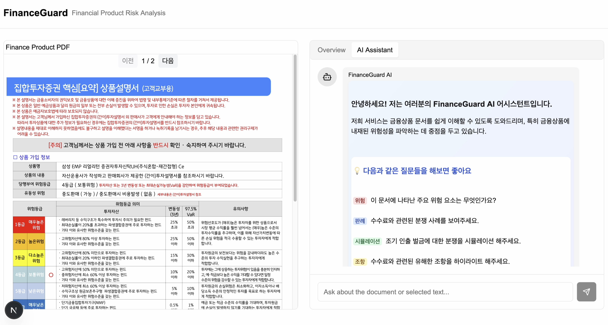
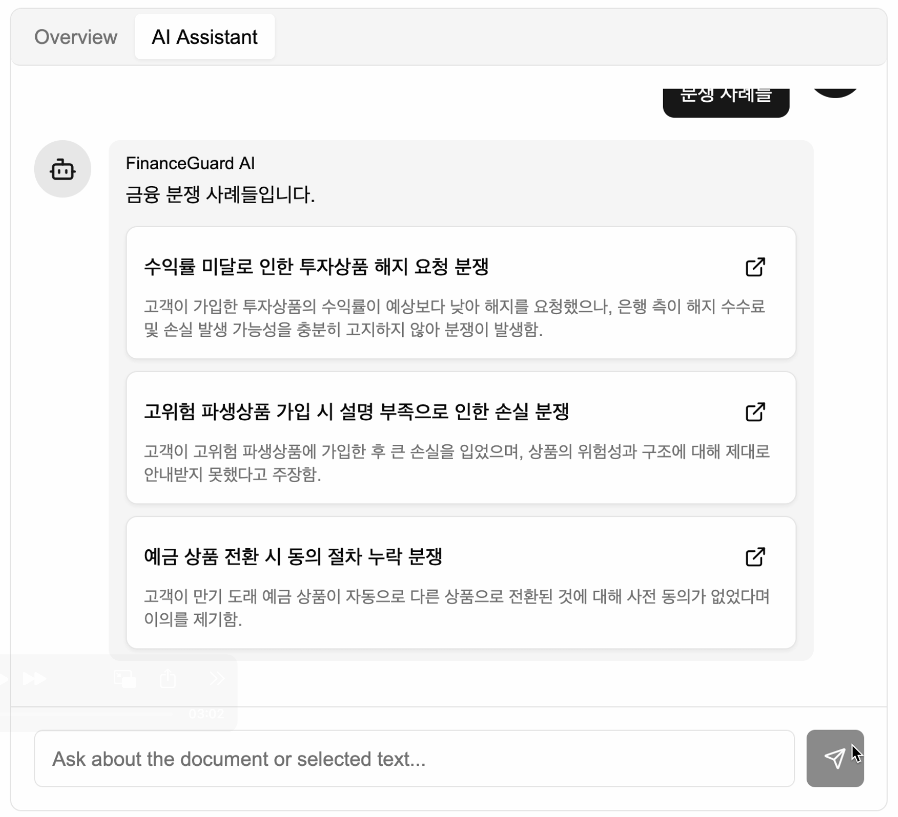

---

# 🛠️ FinanceGuard

### 📌 Overview
FinanceGuard is an financial product helper application designed to support secure financial activities by analyzing hidden risks in finance contracts and providing dispute insights. The project aims to help users easily identify hidden risks in their financial contracts and access valuable dispute resolution insights.

### 🚀 Key Features
- ✅ **Risk Analyslis:** Upoad your financial contract and let our AI agent detect hidden risks. 
- ✅ **Future Risk Simulation:** Anticipate potential risks and explore the scenarios you might encounter.
- ✅ **Highlighted Risk Elements:** 👉 Key risk elements are visually emphasized within your contract PDFs, making them instantly recognizable.
- ✅ **Dispute Cases:** Access historical dispute cases related to your financial product contracts.
- ✅ **Real-Time Financial Insights:** Ask for the latest financial information and receive up-to-date answers sourced from real-time web data.


### 🖼️ Demo / Screenshots




Demo video: [Watch on YouTube](https://youtu.be/2wOQsErrCi4)

### 🧩 Tech Stack
- **Frontend:** React.js, Next.js
- **Backend:** Python, Flask
- **AI Tools:** Langraph, Langchain, Upstage Document_parse, Tavily, Kure (Embedding Retriever Model)
- **Others:** Node.js, pnpm, nvm

### 🏗️ Project Structure
```
📁 FinanceGuard/
├── frontend/
├── backend/
├── assets/         # Images and figures
├── README.md
└── ...
```

### 🔧 Setup & Installation

#### Frontend Setup
```bash
# From the frontend directory, start the frontend server
# Install Node.js using nvm
nvm install node
node -v

# Install pnpm globally
npm install -g pnpm
pnpm -v

# Move to the frontend directory and install dependencies
cd frontend
pnpm install

# Start the frontend development server
pnpm dev
```

#### Backend Setup
```bash
# From the project root, start the backend server
python backend/app.py
```

### 📁 Dataset & References
- **Dataset Used:** The application processes user-uploaded financial contracts.
- **References / Resources:**  
  [Law Disputes Repositiory](https://www.aihub.or.kr/aihubdata/data/view.do?currMenu=&topMenu=&aihubDataSe=data&dataSetSn=71610 ))
  [Financial Supervisory Service Disputes DB](https://www.fss.or.kr/fss/job/fvsttPrcdnt/list.do?menuNo=200179)
  
  
### 🙌 Team Members

| Name           | Role                            | GitHub                                             |
|--------------  |-----------------------------    |----------------------------------------------------|
| Gwanwoo Song   | Project Manager                 | [@Song Gwanwoo](https://github.com/longway13)      |
| Dongha Lim     | Backend/AI Developer            | [@Dongha Lim](https://github.com/donghalim7)       |
| Minseok Kang   | Backend/AI Developer            | [@Minseok Kang](https://github.com/k5911839)       |
| Yeonjoon Hwang | AI Developer                    | [@Yeonjun Hwang](https://github.com/HwangYeonjun01)|

### ⏰ Development Period
- Started     : 2025-03-29
- Last updated: 2025-04-04

### 📄 License
This project is licensed under the [MIT license](https://opensource.org/licenses/MIT).  
See the LICENSE file for more details.


---
